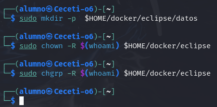
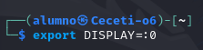
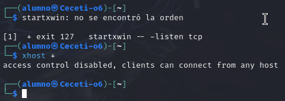
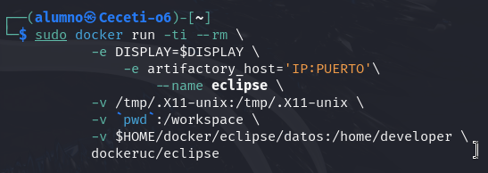
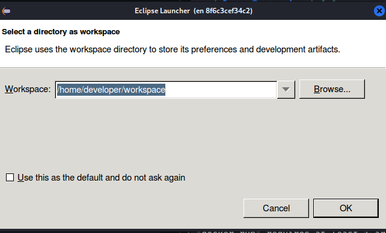
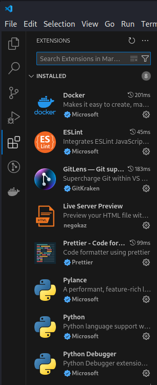
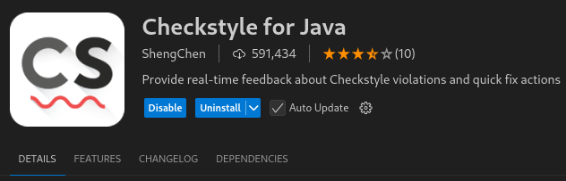
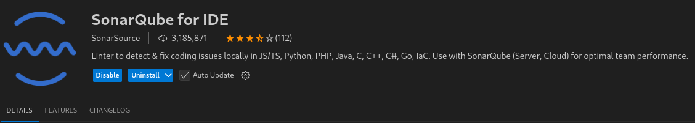
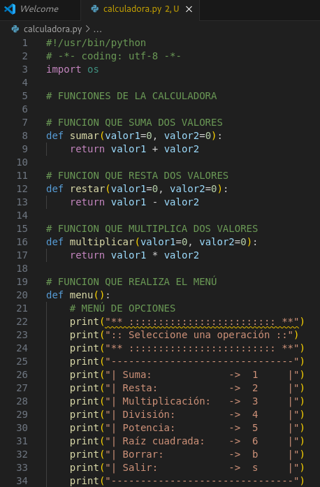
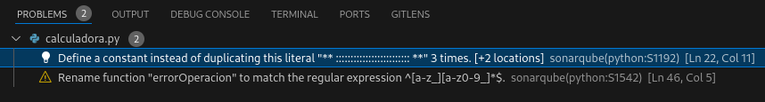

PPS-Unidad1Actividad1-PabloGilGalapero
Actividad 1 de la Unidad 1 de Puesta en Producción Segura. Tabajaremos con los Entornos de Desarrollo

Tenemos varios objetivos:

> [Crear un entorno de desarrollo Eclipse con docker](#Eclipse-Docker)

> [Instalar extensiones en un IDE](#Instalar-extensiones)

> [Probar los entornos de Desarrollo](#Prueba-entornos) 
---
## Eclipse Docker

En [este enlace](https://hub.docker.com/r/dockeruc/eclipse) puedes encontrar podemos crear un contenedor docker con un entorno IDE Eclipse

Lee bien las instrucciones y ten en cuenta que tienes que hacer varias operaciones. Las que tienes a continuación son de un entorno Linux:

1. Crear las carpetas necesarias:
~~~
sudo mkdir -p  $HOME/docker/eclipse/datos
sudo chown -R $(whoami) $HOME/docker/eclipse
sudo chgrp -R $(whoami) $HOME/docker/eclipse
~~~

2. Configurar el entorno gráfico 

~~~
export DISPLAY=:0
startxwin -- -listen tcp &
xhost + 
~~~

 

3. Lanzar el contenedor

~~~
sudo docker run -ti --rm \
           -e DISPLAY=$DISPLAY \
	       -e artifactory_host='IP:PUERTO'\
		   --name eclipse \
           -v /tmp/.X11-unix:/tmp/.X11-unix \
           -v `pwd`:/workspace \
           -v $HOME/docker/eclipse/datos:/home/developer \
           dockeruc/eclipse	

~~~

> __Explica el comando docker que has utilizado__

Con este comando docker vamos a lanzar un contenedor llamado eclipse.

## Instalar extensiones

Las extensiones de un IDE nos van a facilitar la labor de programar, hacer más flexible nuestro IDE, además de hacer nuestros código más seguro.
Tenemos muchas extensiones, tanto para lenguajes de programación específicos como para el IDE.

__Las siguientes operaciones las puedes hacer desde el entorno Eclipse que hemos creado o puedes utilizar el IDE que prefieras en tu equipo__
>__Busca cuáles son las mejores extensiones de eclipse para programadores y las añades desde la tienda de tu IDE__

1. Prettier - Code formatter

  * Descripción: Prettier es una extensión que formatea tu código automáticamente según las reglas que configures,        asegurando un estilo de codificación consistente en tu proyecto.

2. ESLint

  * Descripción: ESLint es una herramienta para encontrar y corregir problemas de estilo y errores en tu código           JavaScript, TypeScript, y otros lenguajes compatibles. Proporciona una retroalimentación instantánea para mejorar     la calidad del código.
  

3. GitLens

  * Descripción: GitLens mejora la funcionalidad de Git en VS Code, proporcionando información detallada sobre los        cambios realizados en tu repositorio, historial de commits, y autoría de líneas de código.
   

4. Live Server

  * Descripción: Esta extensión lanza un servidor de desarrollo local con recarga automática, lo cual es útil para el     desarrollo web. Puedes ver tus cambios en tiempo real sin tener que recargar manualmente la página.
    

5. Bracket Pair Colorizer

  * Descripción: Bracket Pair Colorizer colorea los paréntesis y corchetes de tu código para hacer que sea más fácil      de leer, especialmente en archivos con muchas capas de anidamiento.
    

Para la tarea utilizaré Visual Studio Code como entorno de programación y añadiré éstas extensiones:

Desde el panel de la izquierda vamos a instalar todas las extensiones en el marketplace de Visual Studio

>__ Busca y escribe para qué sirven estos plugins: Checkstyle, Sonar Lint.__

# 1. Checkstyle

Checkstyle es una herramienta de análisis estático de código. Su principal objetivo es ayudar a los desarrolladores a cumplir con los estándares de codificación, asegurando que el código fuente siga un estilo consistente y se apliquen las mejores prácticas. 

 

# 2. SonarLint 

SonarLint es una herramienta de análisis estático de código que ayuda a los desarrolladores a identificar problemas de calidad y errores en tiempo real dentro de su entorno de desarrollo. Se integra con IDEs como IntelliJ IDEA, Eclipse y Visual Studio. Detecta problemas como bugs, vulnerabilidades de seguridad y malas prácticas de codificación.

 

>__Instala los plugins y complementos que has encontrado. Además busca e instala los plugins Checkstyle y Sonar Lint.__

## Prueba entornos

El entorno de desarrollo nos sirve para crear nuestras aplicaciones y además podemos comprobar los errores que tienen, problemas de seguridad, etc. por lo que desde allí vamos a poder corregirlos.
>__Descarga el código fuente de un proyecto java o python: compila, enlaza y ejecutaló. Tienes algunos ejemplos en la carpeta Sources de este repositorio__

Creamos un fichero con la extensión de python y el nombre que queramos darle.

Copiamos el código deseado dentro de archivo

Con el botón Run compilamos

>__Utiliza las herramientas de depuración de Eclipse o Netbeans para depurar el proyecto, y las diferentes extensiones para ver información, problemas, etc.__

Desde el terminal en la sección de problemas podremos ver las recomendaciones de las extensiones instaladas

---
## ENTREGA
>__Crea un repositorio  con nombre PPS-Unidad1Actividad1-Tu nombre que contenga las respuestas a las preguntas y las evidencias de que has realizado las operaciones indicadas.__

>__Sube a la plataforma, tanto el repositorio comprimido como la dirección a tu repositorio de Github.__
